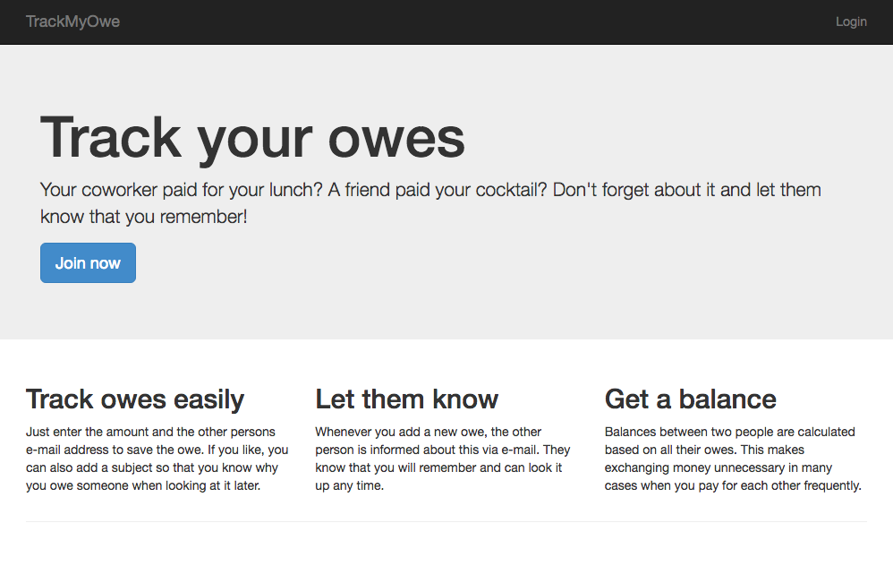
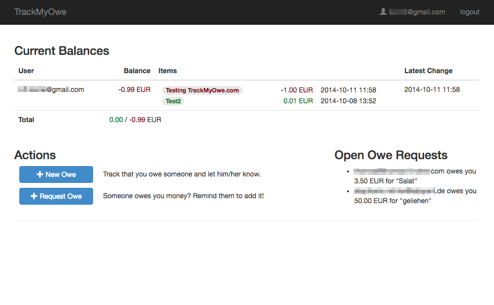

# Track My Owe / zerosum

Track My Owe (referred to zerosum in the code) is a platform with the following goals:

1. Track money owed to/by other people
2. Let the other people know about that fact (and allow them to look it up later)
3. Condense multiple owes between people into a single balance

# Thoughts behind Track My Owe

There are many occasions when people borrow money between each other (e.g. coworkers, a flatshare or a group vacation). It is an unnecessary hassle to resolve every single amount separately. If you trust the other party, you can wait until the owes are either canceled out by owes flowing in the opposite direction or until you want settle the outstanding balance explicitly. This can even work properly across multiple borrowers/lenders. To avoid people registering false owes, the one owing money has to confirm an entry unless he created it himself.

In a way, you can see this as real money transaction system. After all, we are used to treat balances as real money as soon as there is a concesus about the balance between both involved parties.

# Current Status

Development has stopped and probably won't resume. I still think the concept is interesting, but it's probably not easy to make a popular product out of this.

Since Red Hat shut down OpenShift v2, there's no running instance of this, anymore.

# Contact:

Karl Bartel
karl42@gmail.com
